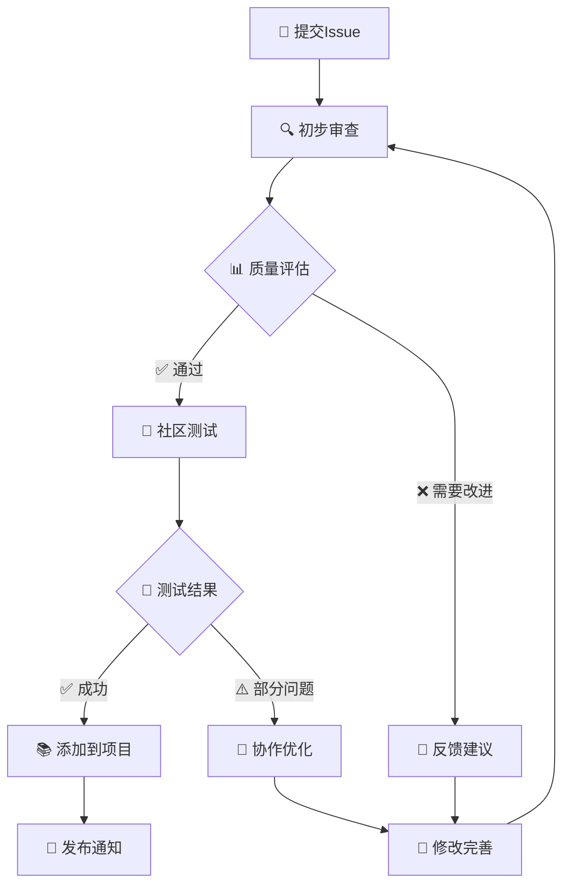

<div align="center">

# 🚀 提示词提交 | Prompt Submission

*感谢你为 Prompts 项目贡献优质内容！*

*Thank you for contributing quality content to the Prompts project!*

---

[](https://github.com/your-username/Prompts)
[](https://github.com/your-username/Prompts/discussions)
[](https://github.com/your-username/Prompts/blob/main/LICENSE)

</div>

---

## 📝 基础信息 | Basic Information

### 🎯 提示词名称 | Prompt Name

<!-- 为你的提示词起一个简洁且描述性的名称 -->
<!-- Give your prompt a concise and descriptive name -->

**中文名称 | Chinese Name**: `[请填写中文名称]`

**英文名称 | English Name**: `[Please fill in English name]`

**简短描述 | Brief Description**: 

> 📝 **命名建议 | Naming Guidelines**:
> - 使用清晰、具体的词汇 | Use clear, specific vocabulary
> - 体现核心功能 | Reflect core functionality  
> - 避免过于宽泛的术语 | Avoid overly broad terms
> - 长度控制在 3-8 个词 | Keep length between 3-8 words

### 📂 技术分类 | Technical Category

<!-- 选择最适合的技术分类 -->
<!-- Choose the most appropriate technical category -->

<details>
<summary>🔧 开发技术 | Development Technologies</summary>

- [ ] 🐍 **Python 开发** | Python Development
  - [ ] Web 框架 (Django, Flask, FastAPI)
  - [ ] 数据科学 (Pandas, NumPy, Matplotlib)
  - [ ] 机器学习 (Scikit-learn, TensorFlow, PyTorch)
  - [ ] 自动化脚本 (Selenium, Requests)
  - [ ] 其他 Python 应用

- [ ] ☕ **Java 开发** | Java Development
  - [ ] Spring 生态系统
  - [ ] 微服务架构
  - [ ] Android 开发
  - [ ] 企业级应用
  - [ ] 其他 Java 应用

- [ ] 🌐 **前端开发** | Frontend Development
  - [ ] JavaScript/TypeScript
  - [ ] React/Vue/Angular
  - [ ] HTML/CSS
  - [ ] 移动端开发
  - [ ] 其他前端技术

- [ ] 🗄️ **数据库技术** | Database Technologies
  - [ ] SQL 数据库 (MySQL, PostgreSQL)
  - [ ] NoSQL 数据库 (MongoDB, Redis)
  - [ ] 数据仓库 (BigQuery, Snowflake)
  - [ ] 数据建模
  - [ ] 其他数据库技术

- [ ] 🚀 **DevOps & 基础设施** | DevOps & Infrastructure
  - [ ] 容器化 (Docker, Kubernetes)
  - [ ] CI/CD 流水线
  - [ ] 云服务 (AWS, Azure, GCP)
  - [ ] 监控与日志
  - [ ] 其他 DevOps 工具

</details>

<details>
<summary>💼 业务应用 | Business Applications</summary>

- [ ] 📊 **数据分析** | Data Analysis
  - [ ] 商业智能 (BI)
  - [ ] 数据可视化
  - [ ] 统计分析
  - [ ] 预测建模
  - [ ] 其他数据分析

- [ ] 🤖 **人工智能** | Artificial Intelligence
  - [ ] 自然语言处理 (NLP)
  - [ ] 计算机视觉 (CV)
  - [ ] 推荐系统
  - [ ] 深度学习
  - [ ] 其他 AI 应用

- [ ] 📝 **内容创作** | Content Creation
  - [ ] 技术文档
  - [ ] 营销文案
  - [ ] 创意写作
  - [ ] 翻译服务
  - [ ] 其他内容创作

- [ ] 💼 **商业分析** | Business Analysis
  - [ ] 市场研究
  - [ ] 竞品分析
  - [ ] 用户研究
  - [ ] 商业策略
  - [ ] 其他商业分析

- [ ] 🎓 **教育培训** | Education & Training
  - [ ] 课程设计
  - [ ] 学习评估
  - [ ] 技能培训
  - [ ] 知识管理
  - [ ] 其他教育应用

</details>

<details>
<summary>🔧 专业工具 | Professional Tools</summary>

- [ ] 🎨 **设计相关** | Design
  - [ ] UI/UX 设计
  - [ ] 平面设计
  - [ ] 产品设计
  - [ ] 品牌设计
  - [ ] 其他设计领域

- [ ] 🔒 **安全相关** | Security
  - [ ] 网络安全
  - [ ] 应用安全
  - [ ] 数据安全
  - [ ] 合规审计
  - [ ] 其他安全领域

- [ ] 📈 **项目管理** | Project Management
  - [ ] 敏捷开发
  - [ ] 团队协作
  - [ ] 资源规划
  - [ ] 风险管理
  - [ ] 其他项目管理

- [ ] 🧪 **测试相关** | Testing
  - [ ] 自动化测试
  - [ ] 性能测试
  - [ ] 安全测试
  - [ ] 用户体验测试
  - [ ] 其他测试类型

- [ ] 🔍 **SEO/营销** | SEO/Marketing
  - [ ] 搜索引擎优化
  - [ ] 内容营销
  - [ ] 社交媒体营销
  - [ ] 数字营销
  - [ ] 其他营销策略

</details>

**自定义分类 | Custom Category**: `[如果以上分类都不适合，请自定义]`

### 🎭 角色定位 | Role Positioning

<!-- 这个提示词主要扮演什么角色？ -->
<!-- What role does this prompt primarily play? -->

| 角色类型 Role Type | 选择 Select | 具体描述 Specific Description |
|-------------------|-------------|-------------------------------|
| 👨‍💻 **开发助手** \| Development Assistant | ☐ | 协助编程、调试、代码优化 \| Assist with programming, debugging, code optimization |
| 📝 **写作助手** \| Writing Assistant | ☐ | 内容创作、文档编写、文案优化 \| Content creation, documentation, copywriting |
| 🎨 **设计师** \| Designer | ☐ | UI/UX设计、视觉设计、用户体验 \| UI/UX design, visual design, user experience |
| 📊 **分析师** \| Analyst | ☐ | 数据分析、业务分析、市场研究 \| Data analysis, business analysis, market research |
| 🏫 **教师/导师** \| Teacher/Mentor | ☐ | 知识传授、技能培训、学习指导 \| Knowledge transfer, skill training, learning guidance |
| 🔍 **研究员** \| Researcher | ☐ | 学术研究、技术调研、信息收集 \| Academic research, technical investigation, information gathering |
| 💼 **顾问** \| Consultant | ☐ | 专业咨询、解决方案、策略建议 \| Professional consulting, solutions, strategic advice |
| 🧪 **测试员** \| Tester | ☐ | 质量保证、功能测试、性能评估 \| Quality assurance, functional testing, performance evaluation |
| 📋 **项目经理** \| Project Manager | ☐ | 项目规划、团队协调、进度管理 \| Project planning, team coordination, progress management |
| 🎯 **专家** \| Expert | ☐ | 领域专业知识、深度分析、技术指导 \| Domain expertise, in-depth analysis, technical guidance |
| 🤖 **AI 助手** \| AI Assistant | ☐ | 智能对话、自动化处理、决策支持 \| Intelligent dialogue, automated processing, decision support |
| 🔧 **工具** \| Tool | ☐ | 功能性工具、自动化脚本、实用程序 \| Functional tools, automation scripts, utilities |
| 📚 **知识库** \| Knowledge Base | ☐ | 信息检索、知识管理、参考资料 \| Information retrieval, knowledge management, reference materials |

**自定义角色 | Custom Role**: `[如果以上角色都不适合，请描述具体角色]`

---

## 🎯 应用场景 | Application Scenarios

### 💼 核心使用场景 | Core Use Cases

<!-- 详细描述这个提示词的主要使用场景 -->
<!-- Describe in detail the main use cases for this prompt -->

<details>
<summary>📋 场景一：[场景名称] | Scenario 1: [Scenario Name]</summary>

| 属性 Attribute | 详情 Details |
|----------------|---------------|
| **场景描述 \| Description** | `[详细描述使用场景和背景]` |
| **目标用户 \| Target Users** | `[具体的用户群体，如：前端开发者、产品经理等]` |
| **使用频率 \| Usage Frequency** | `[每日/每周/每月/按需]` |
| **复杂度 \| Complexity** | `[简单/中等/复杂]` |
| **预期效果 \| Expected Outcome** | `[用户期望达到的具体效果]` |
| **成功指标 \| Success Metrics** | `[如何衡量使用效果]` |

**具体示例 | Specific Example**:
```
[提供一个具体的使用示例]
[Provide a specific usage example]
```

</details>

<details>
<summary>📋 场景二：[场景名称] | Scenario 2: [Scenario Name]</summary>

| 属性 Attribute | 详情 Details |
|----------------|---------------|
| **场景描述 \| Description** | `[详细描述使用场景和背景]` |
| **目标用户 \| Target Users** | `[具体的用户群体]` |
| **使用频率 \| Usage Frequency** | `[每日/每周/每月/按需]` |
| **复杂度 \| Complexity** | `[简单/中等/复杂]` |
| **预期效果 \| Expected Outcome** | `[用户期望达到的具体效果]` |
| **成功指标 \| Success Metrics** | `[如何衡量使用效果]` |

**具体示例 | Specific Example**:
```
[提供一个具体的使用示例]
[Provide a specific usage example]
```

</details>

<details>
<summary>📋 场景三：[场景名称] | Scenario 3: [Scenario Name]</summary>

| 属性 Attribute | 详情 Details |
|----------------|---------------|
| **场景描述 \| Description** | `[详细描述使用场景和背景]` |
| **目标用户 \| Target Users** | `[具体的用户群体]` |
| **使用频率 \| Usage Frequency** | `[每日/每周/每月/按需]` |
| **复杂度 \| Complexity** | `[简单/中等/复杂]` |
| **预期效果 \| Expected Outcome** | `[用户期望达到的具体效果]` |
| **成功指标 \| Success Metrics** | `[如何衡量使用效果]` |

**具体示例 | Specific Example**:
```
[提供一个具体的使用示例]
[Provide a specific usage example]
```

</details>

### 🎯 目标用户画像 | Target User Profile

<!-- 这个提示词主要面向哪些用户？ -->
<!-- Who is this prompt primarily for? -->

**技能水平 | Skill Level**:
- [ ] 🔰 **初学者** | Beginners (0-1年经验 | 0-1 years experience)
- [ ] 📈 **中级用户** | Intermediate Users (1-3年经验 | 1-3 years experience)
- [ ] 🚀 **高级用户** | Advanced Users (3+年经验 | 3+ years experience)
- [ ] 🎓 **专家级** | Expert Level (5+年经验 | 5+ years experience)

**用户类型 | User Type**:
- [ ] 👥 **个人开发者** | Individual Developers
- [ ] 🏢 **团队协作** | Team Collaboration
- [ ] 🏭 **企业用户** | Enterprise Users
- [ ] 🎓 **学生群体** | Students
- [ ] 👨‍🏫 **教育工作者** | Educators
- [ ] 🔬 **研究人员** | Researchers
- [ ] 💼 **专业人士** | Professionals
- [ ] 🌐 **通用用户** | General Users

**行业背景 | Industry Background**:
- [ ] 💻 **科技互联网** | Technology & Internet
- [ ] 🏦 **金融服务** | Financial Services
- [ ] 🏥 **医疗健康** | Healthcare
- [ ] 🎓 **教育培训** | Education & Training
- [ ] 🏭 **制造业** | Manufacturing
- [ ] 🛒 **电商零售** | E-commerce & Retail
- [ ] 🎮 **游戏娱乐** | Gaming & Entertainment
- [ ] 🌐 **跨行业通用** | Cross-industry General

### ⚡ 使用模式 | Usage Patterns

**使用频率 | Usage Frequency**:
- [ ] 📅 **每日使用** | Daily Use (核心工作流程 | Core workflow)
- [ ] 📊 **每周使用** | Weekly Use (定期任务 | Regular tasks)
- [ ] 📈 **每月使用** | Monthly Use (周期性需求 | Periodic needs)
- [ ] 🎯 **项目特定** | Project-specific (特定项目 | Specific projects)
- [ ] 🔧 **按需使用** | On-demand (临时需求 | Ad-hoc needs)

**使用时长 | Session Duration**:
- [ ] ⚡ **快速任务** | Quick Tasks (< 5分钟 | < 5 minutes)
- [ ] 🕐 **短期任务** | Short Tasks (5-30分钟 | 5-30 minutes)
- [ ] 🕑 **中期任务** | Medium Tasks (30分钟-2小时 | 30 min - 2 hours)
- [ ] 🕕 **长期任务** | Long Tasks (> 2小时 | > 2 hours)

---

## 📋 提示词内容 | Prompt Content

### 📝 完整提示词 | Complete Prompt

<!-- 请提供完整的提示词内容 -->
<!-- Please provide the complete prompt content -->

<details>
<summary>🔤 中文版本 | Chinese Version</summary>

```markdown
# 角色设定 | Role Definition
[在此填写角色设定]

# 任务描述 | Task Description  
[在此填写任务描述]

# 输入格式 | Input Format
[在此填写输入格式要求]

# 输出格式 | Output Format
[在此填写输出格式要求]

# 示例 | Examples
[在此提供使用示例]

# 注意事项 | Notes
[在此填写注意事项]
```

</details>

<details>
<summary>🔤 英文版本 | English Version</summary>

```markdown
# Role Definition
[Fill in role definition here]

# Task Description
[Fill in task description here]

# Input Format
[Fill in input format requirements here]

# Output Format
[Fill in output format requirements here]

# Examples
[Provide usage examples here]

# Notes
[Fill in important notes here]
```

</details>

### 🎯 核心特性 | Core Features

<!-- 描述这个提示词的核心特性和优势 -->
<!-- Describe the core features and advantages of this prompt -->

| 特性 Feature | 描述 Description | 优势 Advantage |
|--------------|------------------|------------------|
| **准确性 \| Accuracy** | `[描述准确性表现]` | `[相比其他方案的优势]` |
| **效率 \| Efficiency** | `[描述效率表现]` | `[节省的时间或资源]` |
| **易用性 \| Usability** | `[描述易用性]` | `[降低的使用门槛]` |
| **扩展性 \| Scalability** | `[描述扩展能力]` | `[适应不同场景的能力]` |
| **创新性 \| Innovation** | `[描述创新点]` | `[与现有方案的差异]` |

### 🔧 参数配置 | Parameter Configuration

<!-- 如果提示词包含可配置参数，请在此说明 -->
<!-- If the prompt includes configurable parameters, please explain here -->

<details>
<summary>⚙️ 可配置参数 | Configurable Parameters</summary>

| 参数名 Parameter | 类型 Type | 默认值 Default | 说明 Description |
|------------------|-----------|----------------|-------------------|
| `[参数1]` | `[类型]` | `[默认值]` | `[参数说明和使用场景]` |
| `[参数2]` | `[类型]` | `[默认值]` | `[参数说明和使用场景]` |
| `[参数3]` | `[类型]` | `[默认值]` | `[参数说明和使用场景]` |

**参数使用示例 | Parameter Usage Example**:
```
[展示如何使用和调整参数]
[Show how to use and adjust parameters]
```

</details>

### 🎨 变体版本 | Variations

<!-- 如果有不同的变体版本，请在此说明 -->
<!-- If there are different variations, please explain here -->

<details>
<summary>🔄 提示词变体 | Prompt Variations</summary>

**简化版 | Simplified Version**:
- 适用场景：`[简化版适用场景]`
- 主要差异：`[与完整版的主要差异]`

**增强版 | Enhanced Version**:
- 适用场景：`[增强版适用场景]`
- 主要差异：`[与标准版的主要差异]`

**专业版 | Professional Version**:
- 适用场景：`[专业版适用场景]`
- 主要差异：`[与其他版本的主要差异]`

</details>

---

## 🧪 测试验证 | Testing & Validation

### 📊 测试结果 | Test Results

<!-- 提供测试数据和结果 -->
<!-- Provide test data and results -->

<details>
<summary>📈 性能测试 | Performance Testing</summary>

| 测试指标 Metric | 测试结果 Result | 基准对比 Benchmark | 说明 Notes |
|------------------|-----------------|--------------------|-----------|
| **响应准确率 \| Response Accuracy** | `[百分比]` | `[对比数据]` | `[测试说明]` |
| **任务完成率 \| Task Completion Rate** | `[百分比]` | `[对比数据]` | `[测试说明]` |
| **用户满意度 \| User Satisfaction** | `[评分]` | `[对比数据]` | `[测试说明]` |
| **处理速度 \| Processing Speed** | `[时间]` | `[对比数据]` | `[测试说明]` |

**测试环境 | Test Environment**:
- AI 模型：`[使用的AI模型]`
- 测试数据集：`[测试数据描述]`
- 测试时间：`[测试时间范围]`
- 测试人员：`[测试人员信息]`

</details>

<details>
<summary>🎯 场景测试 | Scenario Testing</summary>

**测试场景一 | Test Scenario 1**:
- 场景描述：`[具体测试场景]`
- 输入示例：`[测试输入]`
- 预期输出：`[预期结果]`
- 实际输出：`[实际结果]`
- 测试结果：✅ 通过 / ❌ 失败 / ⚠️ 部分通过

**测试场景二 | Test Scenario 2**:
- 场景描述：`[具体测试场景]`
- 输入示例：`[测试输入]`
- 预期输出：`[预期结果]`
- 实际输出：`[实际结果]`
- 测试结果：✅ 通过 / ❌ 失败 / ⚠️ 部分通过

**测试场景三 | Test Scenario 3**:
- 场景描述：`[具体测试场景]`
- 输入示例：`[测试输入]`
- 预期输出：`[预期结果]`
- 实际输出：`[实际结果]`
- 测试结果：✅ 通过 / ❌ 失败 / ⚠️ 部分通过

</details>

### 🔍 兼容性测试 | Compatibility Testing

<!-- 测试不同AI模型的兼容性 -->
<!-- Test compatibility with different AI models -->

| AI 模型 Model | 兼容性 Compatibility | 性能表现 Performance | 特殊说明 Notes |
|---------------|----------------------|----------------------|----------------|
| **GPT-4** | ✅ 完全兼容 | `[性能评分]` | `[特殊说明]` |
| **GPT-3.5** | ✅ 完全兼容 | `[性能评分]` | `[特殊说明]` |
| **Claude** | ✅ 完全兼容 | `[性能评分]` | `[特殊说明]` |
| **Gemini** | ⚠️ 部分兼容 | `[性能评分]` | `[特殊说明]` |
| **其他模型** | `[兼容状态]` | `[性能评分]` | `[特殊说明]` |

---

## 📚 文档和示例 | Documentation & Examples

### 💡 使用示例 | Usage Examples

<!-- 提供详细的使用示例 -->
<!-- Provide detailed usage examples -->

<details>
<summary>📝 示例一：[示例名称] | Example 1: [Example Name]</summary>

**场景背景 | Scenario Background**:
`[描述使用场景和背景]`

**输入内容 | Input Content**:
```
[用户输入的具体内容]
[Specific content entered by user]
```

**AI 输出 | AI Output**:
```
[AI生成的输出结果]
[Output generated by AI]
```

**效果评价 | Effect Evaluation**:
- ✅ **准确性**：`[评价准确性]`
- ✅ **完整性**：`[评价完整性]`
- ✅ **实用性**：`[评价实用性]`
- ⚠️ **改进建议**：`[改进建议]`

</details>

<details>
<summary>📝 示例二：[示例名称] | Example 2: [Example Name]</summary>

**场景背景 | Scenario Background**:
`[描述使用场景和背景]`

**输入内容 | Input Content**:
```
[用户输入的具体内容]
[Specific content entered by user]
```

**AI 输出 | AI Output**:
```
[AI生成的输出结果]
[Output generated by AI]
```

**效果评价 | Effect Evaluation**:
- ✅ **准确性**：`[评价准确性]`
- ✅ **完整性**：`[评价完整性]`
- ✅ **实用性**：`[评价实用性]`
- ⚠️ **改进建议**：`[改进建议]`

</details>

<details>
<summary>📝 示例三：[示例名称] | Example 3: [Example Name]</summary>

**场景背景 | Scenario Background**:
`[描述使用场景和背景]`

**输入内容 | Input Content**:
```
[用户输入的具体内容]
[Specific content entered by user]
```

**AI 输出 | AI Output**:
```
[AI生成的输出结果]
[Output generated by AI]
```

**效果评价 | Effect Evaluation**:
- ✅ **准确性**：`[评价准确性]`
- ✅ **完整性**：`[评价完整性]`
- ✅ **实用性**：`[评价实用性]`
- ⚠️ **改进建议**：`[改进建议]`

</details>

### 📖 最佳实践 | Best Practices

<!-- 提供使用最佳实践指南 -->
<!-- Provide best practice guidelines -->

<details>
<summary>💡 使用技巧 | Usage Tips</summary>

**🎯 输入优化 | Input Optimization**:
1. `[输入优化技巧1]`
2. `[输入优化技巧2]`
3. `[输入优化技巧3]`

**⚡ 效率提升 | Efficiency Enhancement**:
1. `[效率提升方法1]`
2. `[效率提升方法2]`
3. `[效率提升方法3]`

**🔧 常见问题解决 | Common Issue Resolution**:
1. **问题**：`[常见问题1]`
   **解决方案**：`[解决方案1]`

2. **问题**：`[常见问题2]`
   **解决方案**：`[解决方案2]`

3. **问题**：`[常见问题3]`
   **解决方案**：`[解决方案3]`

</details>

### 🔗 相关资源 | Related Resources

<!-- 提供相关的学习资源和参考链接 -->
<!-- Provide related learning resources and reference links -->

**📚 学习资源 | Learning Resources**:
- 📖 **官方文档**：`[相关官方文档链接]`
- 🎥 **视频教程**：`[相关视频教程链接]`
- 📝 **博客文章**：`[相关博客文章链接]`
- 💬 **社区讨论**：`[相关社区讨论链接]`

**🔧 工具推荐 | Recommended Tools**:
- 🛠️ **辅助工具1**：`[工具名称和链接]` - `[工具描述]`
- 🛠️ **辅助工具2**：`[工具名称和链接]` - `[工具描述]`
- 🛠️ **辅助工具3**：`[工具名称和链接]` - `[工具描述]`

**📊 数据集 | Datasets**:
- 📈 **训练数据**：`[数据集名称和链接]` - `[数据集描述]`
- 📉 **测试数据**：`[数据集名称和链接]` - `[数据集描述]`
- 📋 **基准数据**：`[数据集名称和链接]` - `[数据集描述]`

---

## 👥 贡献信息 | Contribution Information

### 👤 贡献者信息 | Contributor Information

**主要贡献者 | Primary Contributor**:
- **姓名/昵称 | Name/Nickname**: `[贡献者姓名或昵称]`
- **GitHub 用户名 | GitHub Username**: `[@username]`
- **联系方式 | Contact**: `[邮箱或其他联系方式]`
- **专业领域 | Expertise**: `[专业领域描述]`
- **贡献时间 | Contribution Date**: `[YYYY-MM-DD]`

**协作贡献者 | Collaborative Contributors**:
- `[@contributor1]` - `[贡献内容]`
- `[@contributor2]` - `[贡献内容]`
- `[@contributor3]` - `[贡献内容]`

### 🤝 贡献意愿 | Contribution Willingness

**我愿意提供的帮助 | Help I Can Provide**:
- [ ] 📝 **文档完善** | Documentation improvement
- [ ] 🧪 **测试验证** | Testing and validation
- [ ] 🔧 **功能优化** | Feature optimization
- [ ] 🐛 **问题修复** | Bug fixes
- [ ] 💡 **创意建议** | Creative suggestions
- [ ] 📚 **教程编写** | Tutorial writing
- [ ] 🌐 **多语言支持** | Multi-language support
- [ ] 📊 **性能分析** | Performance analysis
- [ ] 🎯 **用例扩展** | Use case expansion
- [ ] 🔍 **代码审查** | Code review

**时间投入 | Time Investment**:
- [ ] ⚡ **偶尔贡献** | Occasional contribution (< 2小时/月 | < 2 hours/month)
- [ ] 📅 **定期贡献** | Regular contribution (2-8小时/月 | 2-8 hours/month)
- [ ] 🚀 **积极贡献** | Active contribution (> 8小时/月 | > 8 hours/month)
- [ ] 💼 **长期维护** | Long-term maintenance (持续维护 | Continuous maintenance)

**技能专长 | Skills & Expertise**:
- [ ] 💻 **编程开发** | Programming & Development
- [ ] 📝 **技术写作** | Technical Writing
- [ ] 🎨 **UI/UX 设计** | UI/UX Design
- [ ] 📊 **数据分析** | Data Analysis
- [ ] 🧪 **测试工程** | Test Engineering
- [ ] 🌐 **多语言翻译** | Multi-language Translation
- [ ] 📈 **项目管理** | Project Management
- [ ] 🔍 **质量保证** | Quality Assurance

---

## ✅ 质量检查 | Quality Checklist

### 📋 提交前检查清单 | Pre-submission Checklist

**基础要求 | Basic Requirements**:
- [ ] ✅ **提示词内容完整** | Prompt content is complete
- [ ] ✅ **分类选择准确** | Category selection is accurate
- [ ] ✅ **角色定位清晰** | Role positioning is clear
- [ ] ✅ **使用场景明确** | Use cases are well-defined
- [ ] ✅ **目标用户明确** | Target users are clearly identified

**内容质量 | Content Quality**:
- [ ] ✅ **语言表达清晰** | Language expression is clear
- [ ] ✅ **逻辑结构合理** | Logical structure is reasonable
- [ ] ✅ **示例充分有效** | Examples are sufficient and effective
- [ ] ✅ **参数说明详细** | Parameter descriptions are detailed
- [ ] ✅ **错误处理完善** | Error handling is comprehensive

**测试验证 | Testing & Validation**:
- [ ] ✅ **功能测试通过** | Functional testing passed
- [ ] ✅ **性能测试满意** | Performance testing satisfactory
- [ ] ✅ **兼容性测试完成** | Compatibility testing completed
- [ ] ✅ **用户反馈积极** | User feedback is positive
- [ ] ✅ **边界情况处理** | Edge cases are handled

**文档规范 | Documentation Standards**:
- [ ] ✅ **格式规范统一** | Format is standardized and consistent
- [ ] ✅ **中英文对照完整** | Chinese-English correspondence is complete
- [ ] ✅ **链接有效可访问** | Links are valid and accessible
- [ ] ✅ **图片清晰可见** | Images are clear and visible
- [ ] ✅ **代码格式正确** | Code formatting is correct

**社区规范 | Community Standards**:
- [ ] ✅ **遵循项目规范** | Follows project guidelines
- [ ] ✅ **尊重开源协议** | Respects open source license
- [ ] ✅ **内容原创或授权** | Content is original or authorized
- [ ] ✅ **无恶意或有害内容** | No malicious or harmful content
- [ ] ✅ **积极建设性贡献** | Positive and constructive contribution

### 🎯 质量评估 | Quality Assessment

**整体质量评分 | Overall Quality Score**: `[1-10分，请自评]`

**优势亮点 | Strengths & Highlights**:
1. `[优势点1]`
2. `[优势点2]`
3. `[优势点3]`

**改进空间 | Areas for Improvement**:
1. `[改进点1]`
2. `[改进点2]`
3. `[改进点3]`

**创新特色 | Innovation Features**:
- `[创新点1]`
- `[创新点2]`
- `[创新点3]`

---

## 📋 额外信息 | Additional Information

### 🔄 版本信息 | Version Information

**当前版本 | Current Version**: `v1.0.0`

**版本历史 | Version History**:
- `v1.0.0` (YYYY-MM-DD): `[初始版本描述]`
- `v0.9.0` (YYYY-MM-DD): `[测试版本描述]`
- `v0.8.0` (YYYY-MM-DD): `[开发版本描述]`

**计划更新 | Planned Updates**:
- [ ] `[计划更新1]` - 预计时间：`[YYYY-MM-DD]`
- [ ] `[计划更新2]` - 预计时间：`[YYYY-MM-DD]`
- [ ] `[计划更新3]` - 预计时间：`[YYYY-MM-DD]`

### 📄 许可证信息 | License Information

**许可证类型 | License Type**: 
- [ ] 📜 **MIT License** (推荐 | Recommended)
- [ ] 📜 **Apache 2.0 License**
- [ ] 📜 **GPL v3 License**
- [ ] 📜 **Creative Commons**
- [ ] 📜 **自定义许可证 | Custom License**: `[请说明]`

**使用限制 | Usage Restrictions**: `[如有特殊使用限制，请说明]`

**商业使用 | Commercial Use**: 
- [ ] ✅ **允许商业使用** | Commercial use allowed
- [ ] ❌ **仅限非商业使用** | Non-commercial use only
- [ ] ⚠️ **需要特殊授权** | Special authorization required

### 🔗 相关链接 | Related Links

**项目相关 | Project Related**:
- 🏠 **项目主页** | Project Homepage: `[项目主页链接]`
- 📚 **文档站点** | Documentation Site: `[文档站点链接]`
- 💬 **讨论社区** | Discussion Community: `[社区链接]`
- 🐛 **问题反馈** | Issue Tracker: `[问题反馈链接]`

**作者相关 | Author Related**:
- 👤 **个人主页** | Personal Homepage: `[个人主页链接]`
- 💼 **LinkedIn**: `[LinkedIn链接]`
- 🐦 **Twitter**: `[Twitter链接]`
- 📧 **邮箱** | Email: `[联系邮箱]`

### 💬 特殊说明 | Special Notes

**重要提醒 | Important Reminders**:
- ⚠️ `[重要提醒1]`
- ⚠️ `[重要提醒2]`
- ⚠️ `[重要提醒3]`

**已知限制 | Known Limitations**:
- 🚫 `[限制1]`
- 🚫 `[限制2]`
- 🚫 `[限制3]`

**未来计划 | Future Plans**:
- 🚀 `[未来计划1]`
- 🚀 `[未来计划2]`
- 🚀 `[未来计划3]`

---

## 🎉 下一步处理流程 | Next Steps

<div align="center">

### 📋 提交后流程 | Post-submission Process



**预计处理时间 | Expected Processing Time**: 3-7 个工作日 | 3-7 business days

**审查标准 | Review Criteria**:
- 📊 **质量评分** ≥ 8.0/10.0
- 🧪 **测试通过率** ≥ 90%
- 👥 **社区反馈** 积极正面
- 📚 **文档完整度** ≥ 95%

</div>

---

<div align="center">

## 🙏 感谢您的贡献！| Thank You for Your Contribution!

*您的每一个贡献都让这个项目变得更好！*

*Every contribution you make makes this project better!*

---

[](https://github.com/your-username/Prompts/graphs/contributors)
[](https://github.com/your-username/Prompts/pulls)
[](https://github.com/your-username/Prompts/issues)
[](https://github.com/your-username/Prompts/blob/main/LICENSE)

**🌟 如果这个项目对您有帮助，请给我们一个 Star！**

**🌟 If this project helps you, please give us a Star!**

</div>

```
<!-- 请在这里粘贴完整的提示词内容 -->
```

### 🏗️ 结构说明

请确认你的提示词包含以下标准结构：

- [ ] **Role** - 角色定义
- [ ] **Background** - 背景描述
- [ ] **Attention** - 注意事项
- [ ] **Profile** - 详细档案
  - [ ] Author
  - [ ] Version
  - [ ] Language
  - [ ] Description
  - [ ] Skills
- [ ] **Goals** - 目标设定
- [ ] **Constrains** - 约束条件
- [ ] **Workflow** - 工作流程
- [ ] **OutputFormat** - 输出格式
- [ ] **Suggestions** - 建议事项
- [ ] **Initialization** - 初始化

## 🧪 测试验证

### 📊 测试结果

**测试的 AI 模型**:
- [ ] ChatGPT-4
- [ ] Claude-3
- [ ] Cursor
- [ ] Trae
- [ ] Coze
- [ ] 其他: ___________

### 💡 测试用例

**测试场景 1**:
- **输入**: 
- **期望输出**: 
- **实际输出**: 
- **结果评价**: ✅ 通过 / ❌ 失败

**测试场景 2**:
- **输入**: 
- **期望输出**: 
- **实际输出**: 
- **结果评价**: ✅ 通过 / ❌ 失败

**测试场景 3**:
- **输入**: 
- **期望输出**: 
- **实际输出**: 
- **结果评价**: ✅ 通过 / ❌ 失败

### 📈 性能评估

- **响应准确性**: ⭐⭐⭐⭐⭐ (1-5星)
- **输出质量**: ⭐⭐⭐⭐⭐ (1-5星)
- **易用性**: ⭐⭐⭐⭐⭐ (1-5星)
- **稳定性**: ⭐⭐⭐⭐⭐ (1-5星)

---

**感谢你为项目贡献新的提示词！我们会仔细审核并尽快回复。** 🚀

**审核流程**: 提交 → 初步审核 → 测试验证 → 社区反馈 → 正式合并
